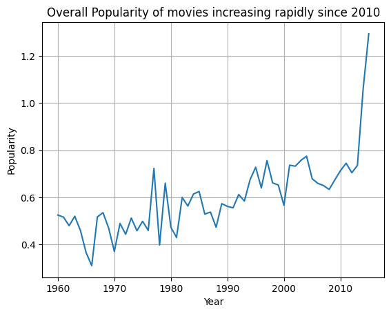
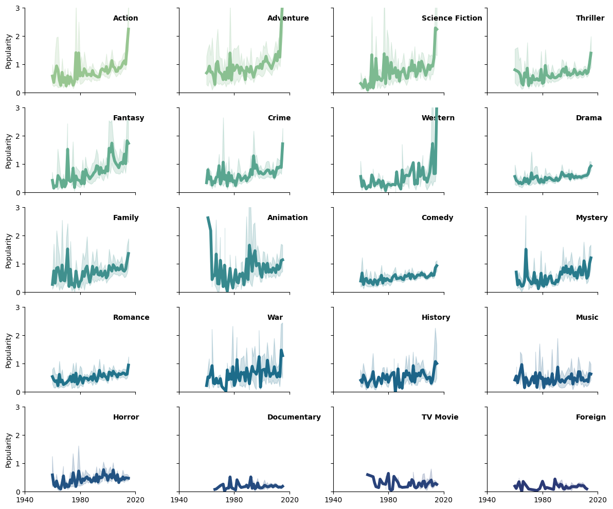
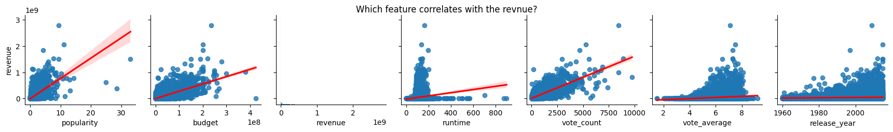

# Introduction

The goal of the project is to analyze the popularity of movies based on a set of data. Mainly to answer the following two questions:

- Research Question 1: Which genres are most popular from year to year?
- Research Question 2: What kinds of properties are associated with movies that have high revenues?

## Data

- I used the Kaggle competition "Popular Movies of IMDb" (see <https://www.kaggle.com/sankha1998/tmdb-top-10000-popular-movies-dataset>) to retrieve necessary data.
This dataset consists of ten thousand movies and related metadata and  features such as Imdb rating, budget, revenue, genres.

-----------

## Results

- Overall Popularity

- Popularity of Each Genre Over the Years

- Effect on Revenue

-----------

## Conclusion

As a result of my work I have found that:

- Overall Popularity of the films is increasing.
- Action, Adventure, Science Fiction, Fantasy, Crime and Westren genre of films have become extremly popular recently.
- A film's revenue correlates with its budget, popularity, and vote count. All of these are somewhat connected to each other.
