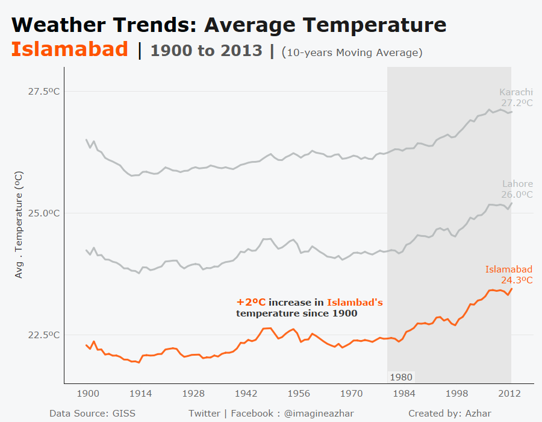

# Average-Temperature-Analysis


# Process:

### Data Collection:
- Used SQL queries to get the data from the database.
Query used:

```
SELECT c.year, c.avg_temp AS city_temp, g.avg_temp AS global_temp, c.city 
FROM city_data c
JOIN global_data g
ON c.year=g.year
WHERE country = 'Pakistan'
```

- Extracted the data as .csv files for further analysis.

### Data Cleaning:
- Data had a few missing values; I filtered them out, although there are other ways to deal with missing values, such as replacing them with median, mean or average.

### Data Analysis:
- Opened the data in tableau for analysis.
- Calculated 10-years moving average using quick table calculations
- Created line charts for the average temperature of Islamabad and average global temperature.
- Added appropriate labels. Moreover, a reference band to show how the global temperature rise compares to that of Islamabad.
- Added a couple of other cities to see how Islamabad compares to those.


## Observations:

- Islamabad's average temperature has risen from 22.3ºC to 24.3ºC since 1900.

- Islamabad's and global average temperature has been rising gradually since 1980. While the  increase in Islamabad's temperature (+1.3ºC) is comparatively more drastic than the increase in global average temperature (+0.6ºC) since 1980.

- Other cities, such as Karachi and Lahore, are hotter than Islamabad. But their average temperature is following the same trend as Islamabad. 
# Visualizations


